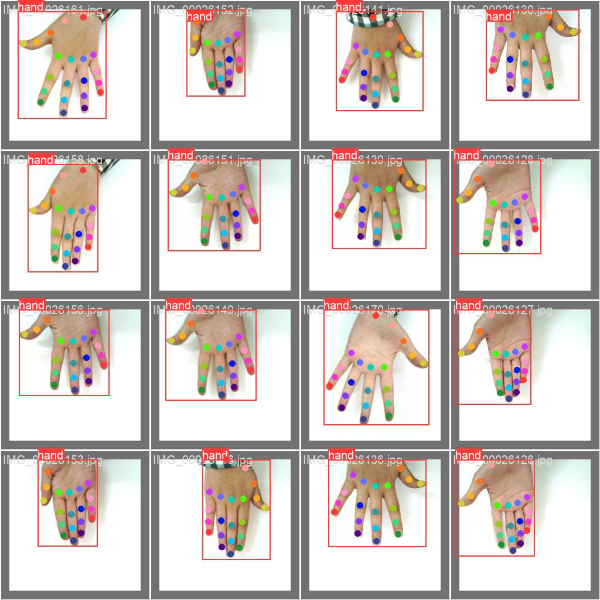
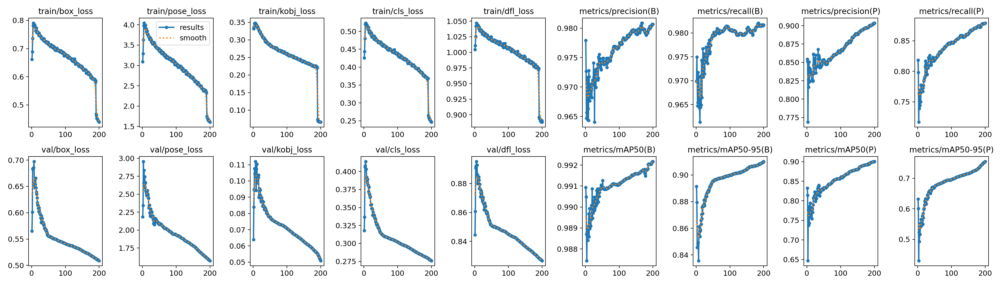

# YOLOv8n-Pose Hand Pose Detection



This repository contains the code and resources for a custom hand pose detection model trained using the YOLOv8n-pose framework by [ultralytics](https://www.ultralytics.com/). The model is trained on a custom dataset of hand keypoints available on [Kaggle](https://www.kaggle.com/datasets/riondsilva21/hand-keypoint-dataset-26k).

**Important Note:** Due to computational limitations, the model has only been trained to 50% of its potential. However, it still demonstrates excellent performance.

**Project Goal**

The primary objective of this project is to contribute to the development of state-of-the-art (SOTA) models for hand pose detection, specifically targeting applications in sign language classification and AR/VR.


**What's Included:**

* Training scripts for the YOLOv8n-pose model on the custom hand keypoint dataset.
```
cd ./train
```

* Pre-trained model weights (50% trained).
```
cd ./model
```

* Configuration files and scripts for inference with the trained model.
```
cd ./inference
```

**Future Developments:**

* Continue training the model to achieve full capacity and improve accuracy.
* Explore advanced techniques for hand pose estimation and landmark detection.
* Integrate the model into sign language classification and AR/VR projects.

**Contribution**

We welcome contributions from the community to enhance this project. Feel free to:

* Fork the repository and experiment with different training configurations.
* Implement additional functionalities for hand pose estimation.
* Share your ideas for integrating the model into sign language and AR/VR applications.

**Let's build better hand pose detection models together!**




----
### Follow me

>GitHub [@RionDsilvaCS](https://github.com/RionDsilvaCS)  ·  Linkedin [@Rion Dsilva](https://www.linkedin.com/in/rion-dsilva-043464229/)   ·  Twitter [@Rion_Dsilva_CS](https://twitter.com/rion_dsilva_cs)
